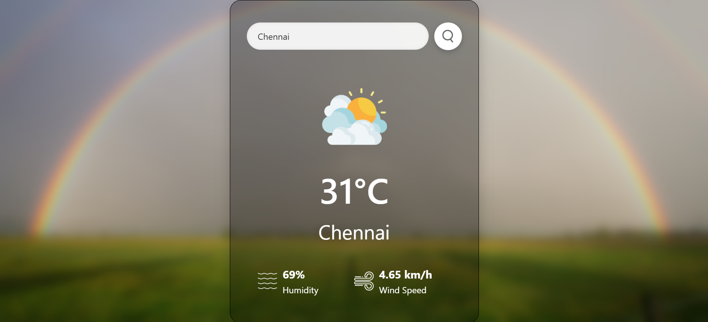

# ⛅ Weather App

A modern and sleek **Weather Forecast Web App** that provides real-time weather information for any city using the OpenWeather API. Built using **HTML**, **CSS**, and **JavaScript**, this project showcases dynamic data fetching and UI updates.

---

## 📸 Preview



---

## 🚀 Features

- 🔍 Search weather by **city name**
- 🌡️ Displays:
  - Temperature
  - City name
  - Weather icon
  - Humidity
  - Wind speed
- 🧊 Glassmorphism design with blurred background
- ⚡ Real-time API integration with OpenWeather
- 📱 Fully responsive layout

---

## 🧰 Technologies Used

- **HTML5**
- **CSS3** (Glassmorphism, gradient effects)
- **JavaScript**
- **OpenWeather API**

---

## 📦 How to Use

   ```bash
1. Clone the repo:
git clone https://github.com/vinaya2007/Weather.git


2. Navigate to the project folder:
cd Weather

3. Open index.html in your browser.
```

📬 Contact
📧 vinayavinodh07@gmail.com 
📞 +91 90032 80933

Credits Built by Vinaya V
